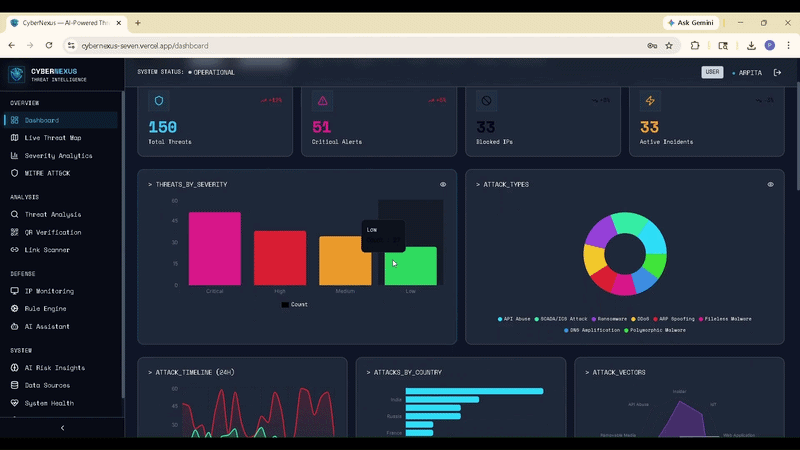
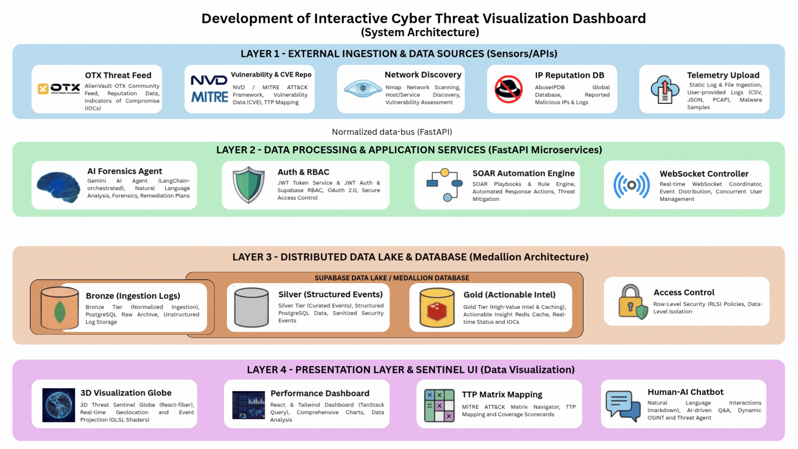

# CyberNexus: Interactive Cyber Threat Visualization Dashboard

This repository contains the complete documentation, research, and project management assets for the CyberNexus platform.

---

https://github.com/user-attachments/assets/99fa489a-a87a-4629-8e0c-038b057edeb4

## 🚀 Quick Links

* 🌐 **Live Demo:** [cybernexus-seven.vercel.app](https://cybernexus-seven.vercel.app/)
* 💻 **Development Repository:** [View Source Code on GitHub](https://github.com/Arpita0704AD2110/Cybernexus)

### 🎥 Project Video Demo
*Click the preview below to watch the full 14-minute demo on YouTube:*

  

---

## 📂 Project Structure & Deliverables

This repository is organized into the following sections for Internship evaluation:

### 1. Planning & Agile Documentation
* **Agile Docs:** [Agile Documentation](./Agile_Team_B2.xlsx)
* **PPT:** [Project Presentation](./Interactive%20Cyber%20Threat%20Visualization%20Dashboard.pptx)

**System Architecture Diagram:**

  

### 2. Research & Tasks
* **Model Research:** [Detailed Research PDF](./Model%20Research.pdf)
* **Python Implementation:** [Jupyter Notebook](./Python_Task.ipynb)
* **Data Analysis (SQL):** [SQL Task Script](./SQL_Task.ipynb)

### 3. Technical Core
The actual development, frontend, and deployment logic are maintained in the **[Cybernexus Development Repo](https://github.com/Arpita0704AD2110/Cybernexus)** to ensure a clean separation between documentation and production code.

---

## 🛠 Tech Stack

* **Documentation:** Microsoft Word (for research), Microsoft Excel (for agile doc)
* **Development:** React, TypeScript, Vite, Tailwind CSS
* **Analysis:** Python (Pandas/NumPy), SQL
